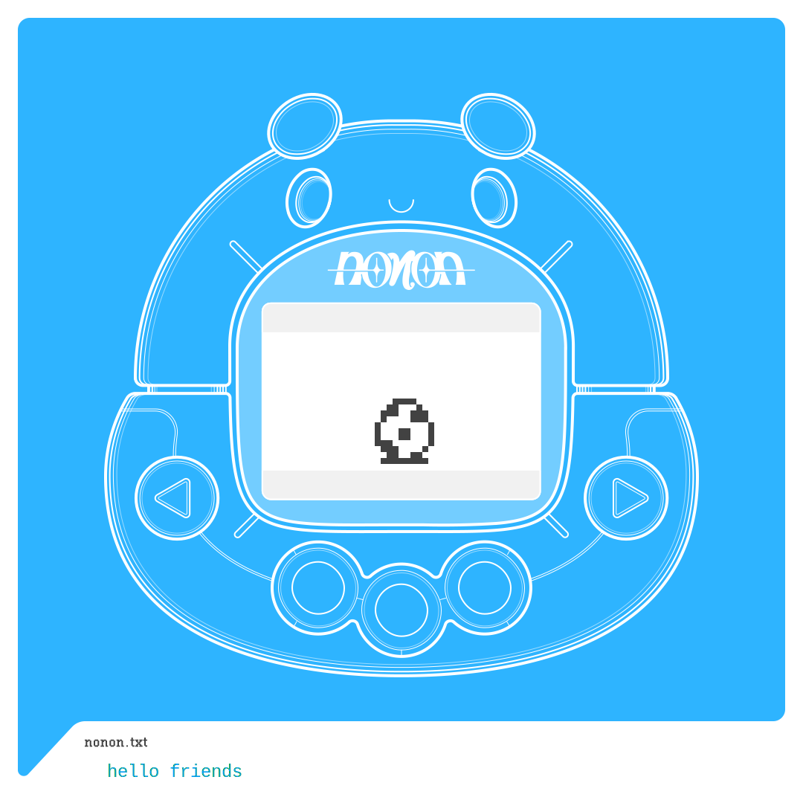

# Nonon Friend Card

When you first cross paths with a nonon, you might notice a new item in your posession.

Your Nonon Friend Card!

Your nonon friend card is a soulbound NFT, limited to one per user, that grows and changes as you encounter more nonons.

## How does this work?

The nonon friend card is a one of a kind, fully on chain NFT that serves dynamic data based on your on-chain engagement 
with the nonon collection.

The nonon friend card features dynamic artwork constructed during a chain call, without the need to host any data on image hosting
services, IPFS, or anywhere other than ethereum.

It is a soulbound NFT and transfers to other wallets are disabled! The nonon friend card is a personal record of your
engagement with the wide world of nonon. You are free to burn your nonon friend card if you wish, but you will be given a new one
the next time you engage with a nonon.
