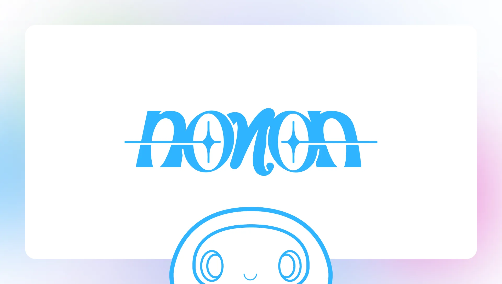

# What is nonon? 

Nonon is the latest on-chain project by creative blockchain studio [mini labo](https://mini-labo.org).

Nonon is a celebration of Form.
Nonon is a rejection of ugliness, lies, and evil.

Nonon is a an experiment in living blockchain art, featuring a 5000 piece collection of expressive hand crafted characters by [three](https://twitter.com/three________), and a 100% on-chain evolving artwork that
doubles as vessel for your Logos.

Nonon features a first of its kind [reward system](./card.md) that lays the foundation for a new age of Truth and Beauty.

# What is Nonon-Kei?

[dive deeper](./nonon-kei-manifestum.md)
