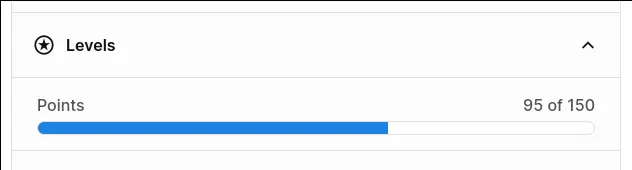

# Levels

As you help the nonons spread across the world and collect more and more points, your friend card will evolve to reflect your increasing power.
Reaching point thresholds for the levels below will upgrade your card, changing its metadata and visuals.

## Level point requirements

| Level | Points |
| ----- | ------ |
| 1 | 0 |
| 2 | 10 |
| 3 | 50 |
| 4 | 150 |
| 5 | 500 |
| 6 | 1500 |
| 7 | 3500 |
| 8 | 7500 |

Your progress towards the next level is included in the on-chain metadata for your nonon friend card, 
so you can easily view it on supporting marketplaces.

Remember that you get a [point for both sending and receiving each unique nonon](./points.md), so
trades of nonons on secondary marketplaces will help you grow your friend card!
