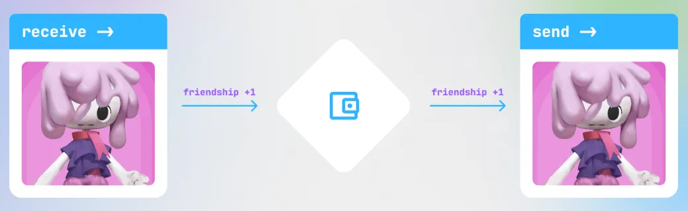

# Nonon Friend Points

Nonons are restless wanderers who are constantly on the lookout for new friends.
Each nonon that crosses your path will leave a record of their time with you.

## what does this mean?

For every unique nonon that enters your wallet, you will get 1 point!
You will get 1 more point for every unique nonon that leaves your wallet.
This means that you can earn a total of 2 points per nonon. 

## what do the points do?

nonon friendship points have some benefits including:
- Increasing the [level](./levels.md) of your [friend card](../card.md)
- Compete to earn a spot on the [nonon.house](nonon.house) leadership board and broadcast your custom message 
- Possible future rewards and opportunities that are yet to be revealed...
